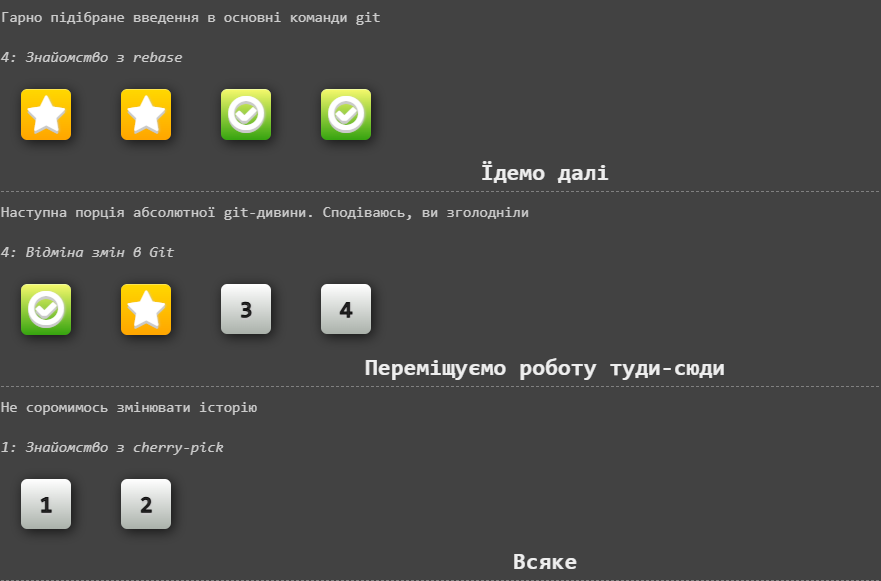
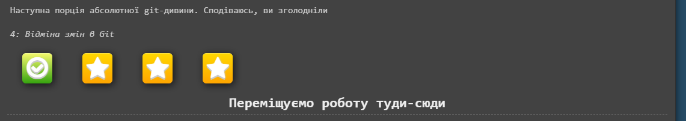

# 🧠 Git Mastery Progress – Learn Git Branching

Цей репозиторій документує мій прогрес у проходженні інтерактивного курсу **[Learn Git Branching](https://learngitbranching.js.org/?locale=uk)**. Тут зібрано мій шлях, рівні, які я вже опанував, та наступні цілі.

---

## 📘 Категорії рівнів

### ✅ Основи

- **Вступ**
  - ✔️ Ознайомлення з основними командами `git`
  - ✔️ `rebase` — що це таке і як ним користуватись
- **Ідемо далі**
  - 🧪 Відміна змін у Git (частково пройдено)
- **Переміщуємо роботу туди-сюди**
  - 🔜 Cherry-pick (почато)
- **Не соромимось змінювати історію**
  - ✔️ Знайомство з інтерактивним rebase

---

## 📸 Прогрес у зображеннях

### 🔹 Основи та rebase

### 🔹 Розділ «Відміна змін у Git»

### 🔹 Інтерактивний rebase

---

## 🎯 Що далі?

- [ ] Завершити всі рівні з **cherry-pick**
- [ ] Пройти повністю **відміну змін у Git**
- [ ] Освоїти всі розділи з вкладки **"Віддалені репозиторії"**

---

## 🧰 Інструменти

- Сайт: [learnGitBranching.js.org](https://learngitbranching.js.org/?locale=uk)
- Git CLI (для практики)
- Markdown (`README.md` — для прогресу)

---

## 🧡 Навіщо це?

Робота з Git — це не просто збереження коду. Це інструмент історії, порядку, сили й відновлення.  
Цей репозиторій — моя карта подорожі Git-воїна 🚀

